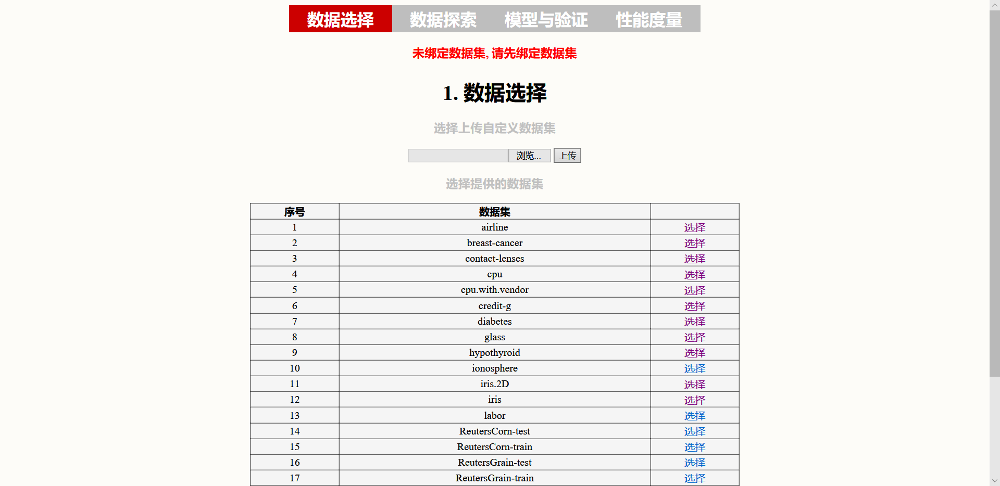
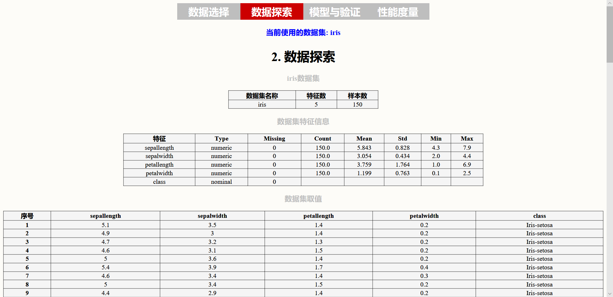
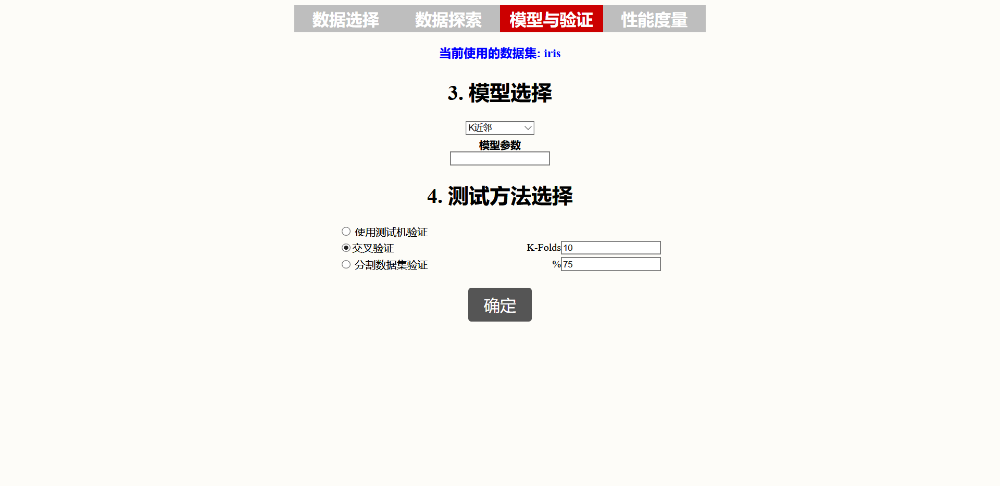
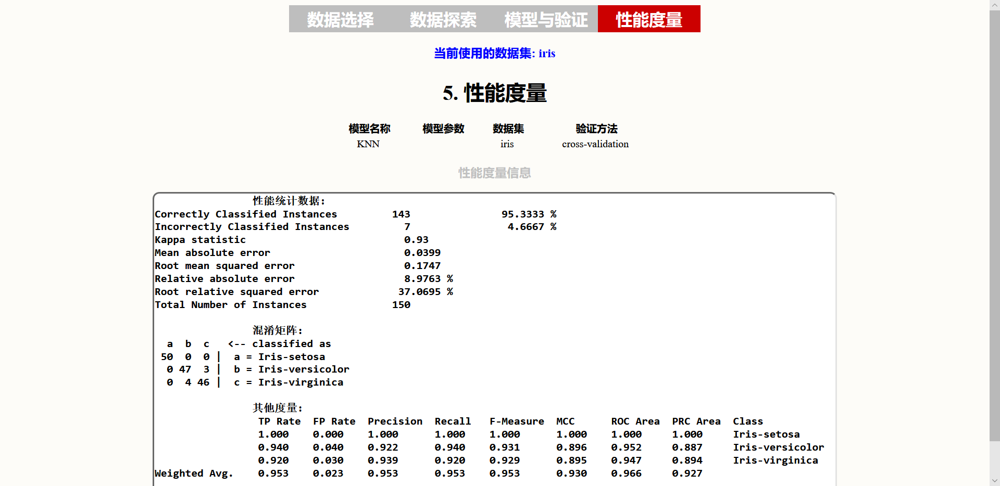

# SimpleDataMiningOnline

一个简单的在线数据挖掘。

- 原先版本是使用 JSP + Servlet + WekaAPI 实现，直接用的Eclipse EE，没有用到 Maven。

- 新版本基于 Maven, 使用了 Spring boot + Vue 实现，采用了前后端分离的方式。

## 介绍

登上web,可以选择上传数据或采用已提供的数据，查看数据集统计信息和样本值，然后选择合适的机器学习模型和测试方法进行训练与测试，系统后台训练完成后返回显示性能度量结果。

### 功能板块

**数据准备**，**数据探索**，**模型与测试方法选择**，**性能度量**，分别对应了四个网页

### 技术栈

- **后端**: Spring boot 、Spring Data JPA 、Weka JavaApi

- **前端**: Vue、Axios

## 运行

- clone 项目到本地，编译运行 maven项目 `simple-datamining-online` 的 `DataMiningOnlineApplication`类 `main` 方法。
