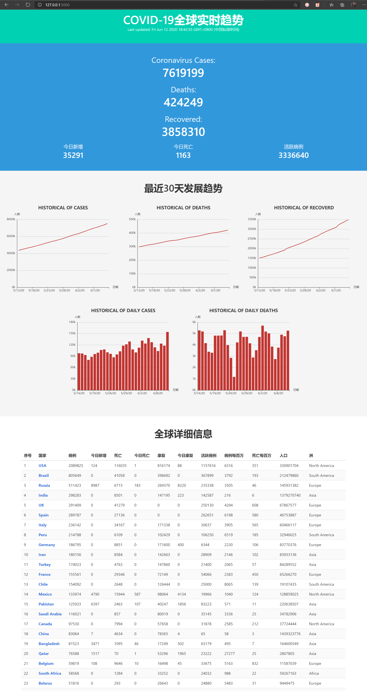
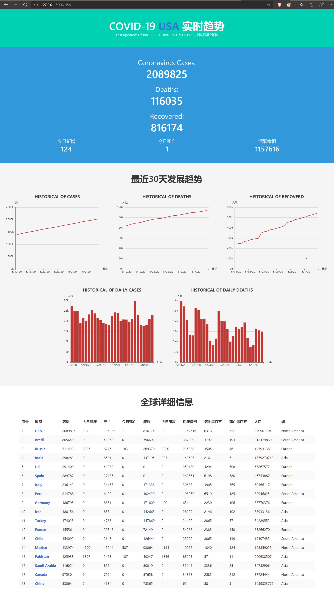

# COVID-19全球实时趋势

## 项目简介

一个展示 COVID-19 全球实时趋势的 web 应用，基于 Vue/Bulma/Echarts 和 Flask 构建。

- 参考: [www.worldometers.info/coronavirus/](https://www.worldometers.info/coronavirus/)
- 数据源: [NovelCOVID/API](https://github.com/novelcovid/api)

## 功能特性

- 查看全球的实时疫情趋势

- 查看特定国家的实时疫情趋势

- 可直接点开 HTML 文件浏览，虽然缺少路由跳转功能

### URL路径

- `/` GET：COVID-19全球实时趋势

- `/:country` GET：COVID-19国家实时趋势

- `/api/valid/:country` GET: 判断国家名称/iso2/iso3是否有效

- `/xxx.[js|css|ico]` GET: 静态文件

## 部署安装

### 环境依赖

- Python3.6+

- Flask1.1.1

- JavaScript相关无，都采用 CDN 方式引入

### 运行

1. `git clone` 项目到本地

2. 运行 `python app/application.py`

3. 浏览器访问 `localhost:5000/`

## 版本内容更新

- 6/12/2020: 基本内容构建完成。

## 开发者

- **@onemsg**(kvimsg@live.com) [😋GitHub](https://github.com/onemsg) | [😄博客](https://blog.csdn.net/OnedayIlove)

## 协议

不懂，没😂
