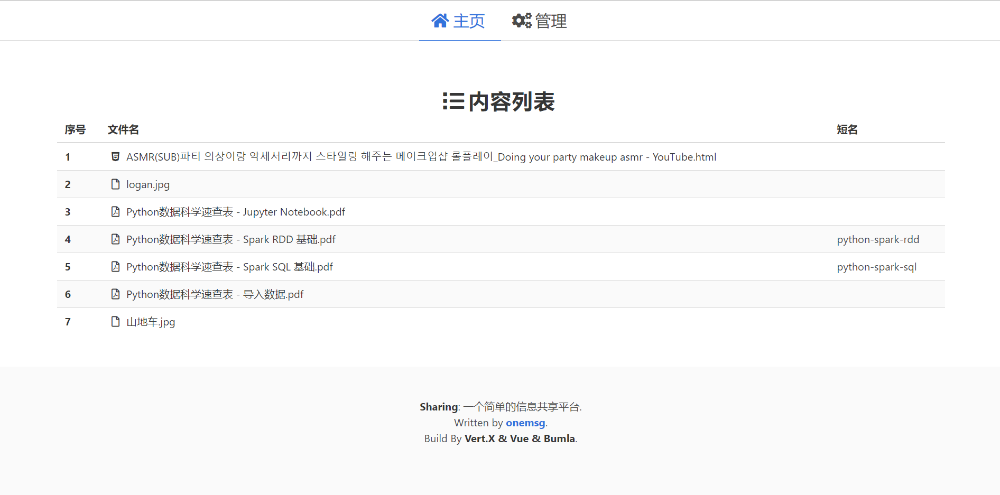
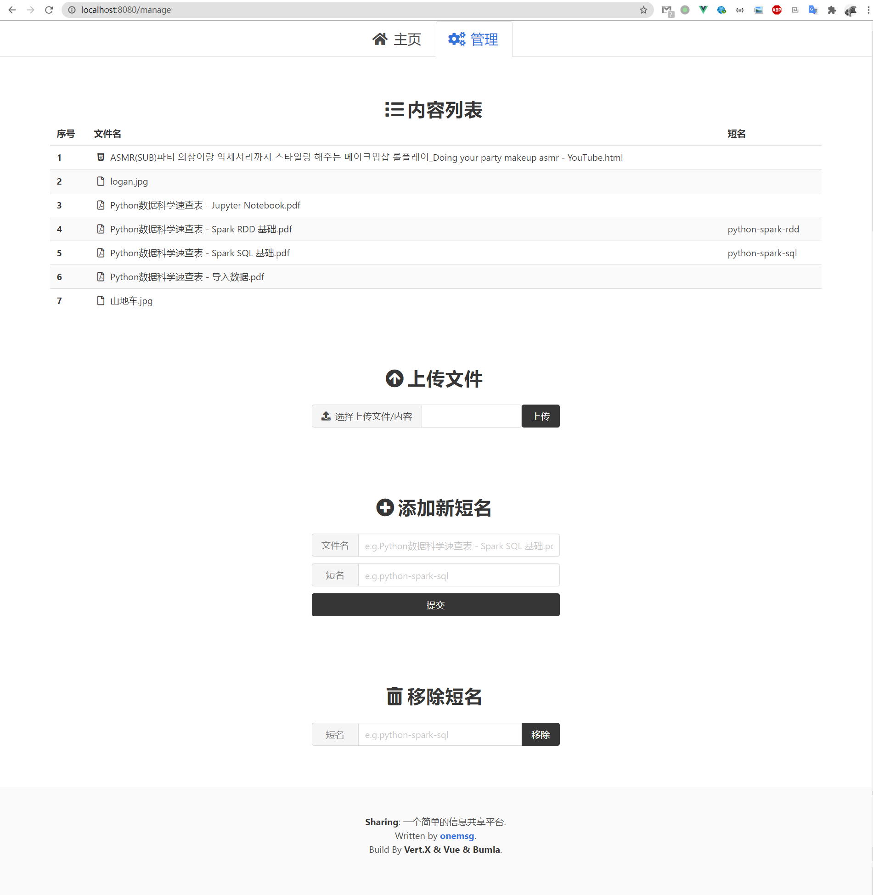
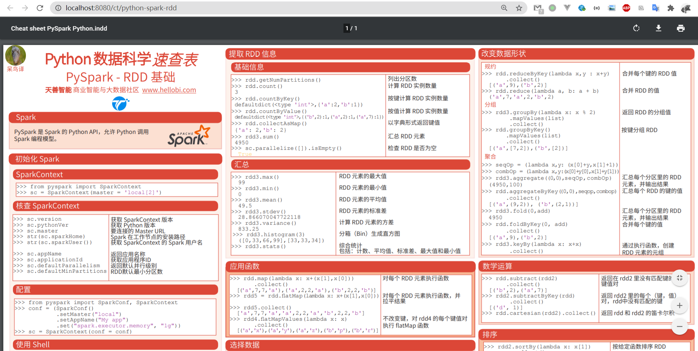

# simple-info-sharing 简单信息共享服务

## 介绍

这是一个简单的信息共享平台，信息具体地指其实是 html、pdf 这些能直接被浏览器解析的文件，信息上传到平台后，其他人可以直接查看/浏览。

### 功能

#### 前端

由 Vue、[Bulma](https://bulma.io/) 构建

- 上传文件，支持格式: html、pdf、zip压缩文件（包含html和css、图片的）

- 查看可访问的所有文件

- 添加、删除路由映射

#### 后端

由 [Vert.X](https://vertx.io/) 构建

- 文件管理：解压文件、删除文件、保存文件、读取所有文件

- 路由映射，返回需要访问的文件页面

- 获取上传的文件，保存到本地

## 安装部署

1. clone 项目到本地，修改配置文件

2. 打包，运行 jar 的 `com.onemsg.infosharing.Server` 类；或者 IDE 直接运行 `Server` main 方法

3. 打开 `localhost:8080` 访问

## 作者

- @onemsg(kvimsg@live.com)
