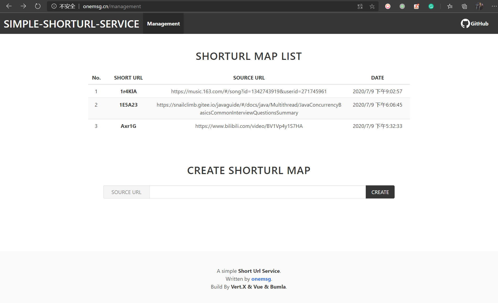
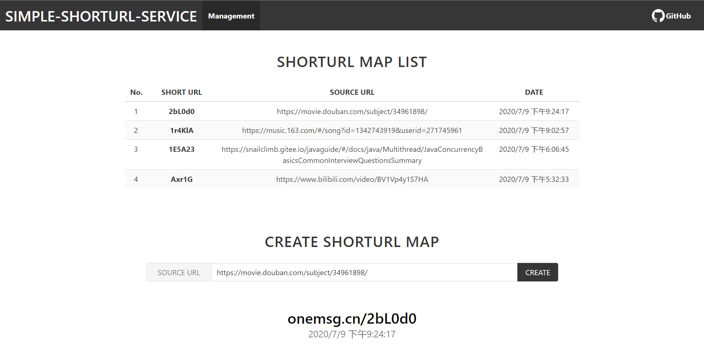

# Simple Shorturl Service | 简单短网址服务

一个简单的短网址服务系统，可通过 RESTful API 来生成新短网址，短网址与原网址的映射存储在 Redis 数据库中，用户请求短网址时会被重定向到原网址。

后台使用 [Vert.X-Web](https://vertx.io/docs/vertx-web/java/) 和异步编程，web服务和redis服务之间通过 EventBus 通信。 短网址生成使用原网址到62进制映射的方案。

短网址服务原理可参考 [短网址(short URL)系统的原理及其实现 | 思否](https://segmentfault.com/a/1190000012088345)





## Web

- **`GET /s/:shortUrlKey`** | 通过短网址，重定向到原网址

- **`GET /management`** | 管理中心，查看所有短网址映射和创建新短网址

- **`POST /api/shorturls {'srcUrl': 'source url'}`** | 返回提交原网址的 短网址

    ```json
    {
       "shortUrl": "5Fdx6l",
       "srcUrl": "xxx.com/xxx/xxx",
       "created": "2020-4-28 16:22",
    }
    ```

- **`GET /api/shorturls`** | 返回已创建的所有短网址

    ```json
        [ 
            {
                "shortUrl": "5Fdx6l",
                "srcUrl": "xxx.com/xxx/xxx",
                "created": "2020-4-28 16:22"
            }
        ]
    ```

- Rest Response ErrorModel

    ```json
        {
            "status": 500,
            "message": "xxx",
            "detail": "xxx"
        }
    ```

## 类/文件简要说明

- `shorturl.common.Convertor` 是一个工具类，主要用来把十进制整数转62进制，和把一个字符串转62进制。

- `shorturl` 包中都是各个 `verticle`。 `StoreVerticle` 用来创建和管理 Redis 数据库，以及通过事件机制（异步）相应 Redis 的读写请求；`WebVerticle` 用来创建 web 服务，提供 RESTful API 管理接口和短域名的路由重定向，它会异步请求读写 Redis。

- `shorturl.MainVerticle` 部署和运行 Vert.X 服务。

- `webroot\management.html` 基于 Vue 和 Bulma 构建的前端管理界面，用来查看已创建的 shorturl 和 创建新 shorturl。

- `auto.py` 自己编写的 python 自动化程序，自动完成 maven 打包 -> jar 部署服务器 -> 重启 jar 应用。

## 其他说明

- 数据存储为什么不用 ConcurrentHashMap 或 MySQL?

因为我想应用重启后，之前创建的短域名能再次使用，因此必须使用外置的数据库，放弃 ConcurrentHashMap。因为 Web 层已经使用了 Vert.X，一个异步的、高并发性能的框架（工具套件），再使用低性能的关系型数据库肯定不匹配，因此使用了 NOSQL 数据库 Redis, 另外数据存储内容也很简单。

- 有什么需要改进的吗？

当然很多，第一件容易改进的就是让日志系统打印出更详细、具体的内容。另一个，有些挑战性的就是，当短域名创建的多时，如何处理62进制短网址的同名冲突，一个简单的思路是生成短域名后，去检测 Redis 里是否已存在相同键（短域名），如果存在，则把短域名做个小修改（比如+1），然后再去 Redis 里检测是否有相同键，直到不存在相同键为止。*（欢迎评论区大佬给建议）*

## 运行

首先确保 Redis 数据库已启动，JDK version 17或以上

1. `mvn exec:java `；

2. 或生成 jar 包，运行 `java -jar short-url-**.jar`；

3. 访问 `http://localhost:5000/management` 进入管理中心界面；

4. 访问路径 `http://localhost:5000/s/:short-url-key` 测试短域名服务
