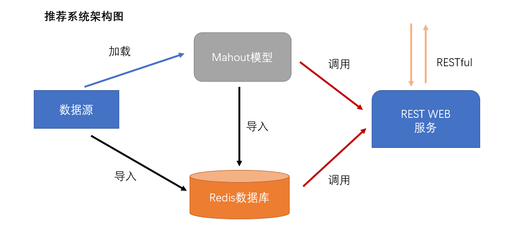
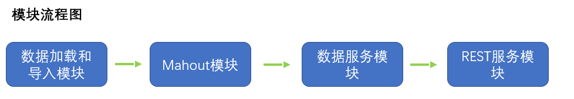
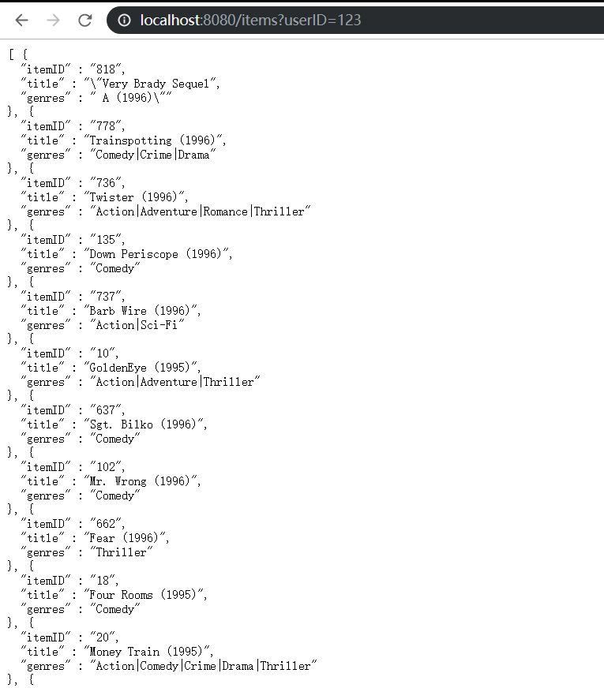
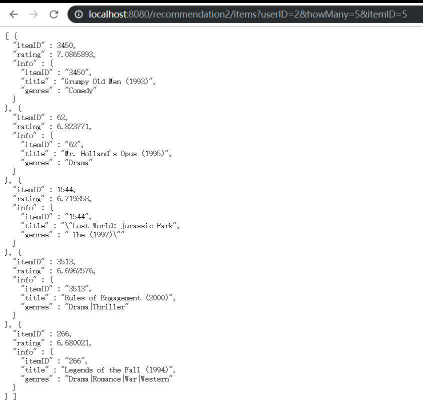
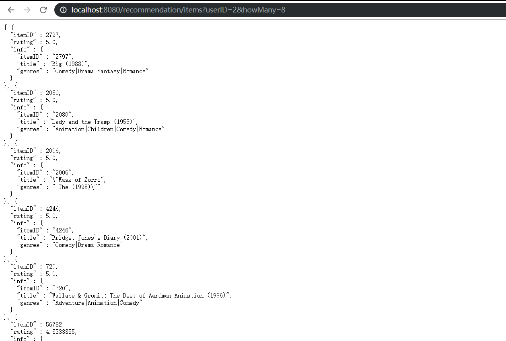

# videos-recommender

一个简单的基于 Mahout 库的电影推荐系统，使用了 Redis 作为缓存，Vert.X 构建 web 服务以提供 RESTful 服务。[2019/12]

## 说明

### 用到的数据

- [ml-20m](https://grouplens.org/datasets/movielens/)

### 系统架构和流程模块

数据源数据一部分加载到Mahout的类中，生成模型保运行在JVM中，并把一部分模型数据保存到Redis数据库中，另一部分导入到Redis中；REST WEB服务接收到来自客户端的请求后调用Mahout模型和Redis数据库，最后返回结果到客户端。

- 数据加载和导入模块：提取文件系统中的数据，导入到Mahou模型中和Redis数据中。

- Mahout模块：基于用户和电影数据，提供推荐系统模型。

- 数据服务模块：封装了对模型和数据库的调用，可直接返回Json格式的推荐信息。

- REST服务模块：web服务，针对不同路由和参数调用数据服务模块，返回json数据给前端。

### 关于推荐系统

推荐系统就是对用户的喜爱做出预测。推荐系统分为两大类：

- **基于内容的系统**: 这类系统主要考察的是推荐项的性质，例如一个B站用户喜欢看三次元舞蹈，那么系统将会把数据库里属于“三次元舞蹈”的视频推荐给他。

- **协同过滤系统**:  这类系统通过计算用户或/和项之间的相似度来推荐项，比如与某用户相似的用户所喜欢的项会推荐给该用户。本次课题就是采用此类推荐系统。

**协同过滤**: 先识别相似用户，然后基于相似用户喜爱的项进行推荐称为协同过滤。

如何计算找到相似的用户们可以使用相似度计算，常用的有Jaccard相似度、余弦相似度和皮尔逊相似度。

### 设计思路

1. 创建数据导入到 Redis 数据库的类 DataToRedis，功能在于把数据从文件中读取，并以合适的 key：value 格式导入到 Redis 数据库中，因为最终是 Restful 服务，所以 value 都以 json 字符串形式保存。

2. 创建封装了 Mahout 提供推荐模型的类，功能在于加载数据到模型中，并对外提供各种推荐系统模型对象。

3. 创建数据服务类，里面包含了一堆方法，用来基于给定参数，（因为要提供Restful 服务）返回的 json 字符串格式的推荐结果。这些方法会调用保存在 JVM 中的推荐模型对象和 Redis 里的信息，做一个整合。

4. 创建 REST WEB 服务，使用 Vertx 框架，创建起来很方便。写出所需要的URL路由映射和处理器，处理器会获得 request 对象中的请求参数，来调用刚刚的数据服务类，把返回的 json 结果写入到 response 里，返回给客户端。

5. 一个运行主类，为了启动、初始化上面创建的类，在 JVM 生成相应的对象，来保证 REST WEB 服务正常运行。

### RESTful API 接口

URL 接口和参数 | 说明
--- |---
`/items?userID={userID}` | 返回用户userID看过的视频/电影信息
`/recommendation/items?userID={userID}&howMany={howMany}` | 基于用户的推荐系统，返回推荐给userID的howMany个视频信息；如果没有提供howMany参数，默认为10，下同
`/recommendation2/items?userID={userID}&itemID={itemID}&howMany={howMany}` | 基于商品的推荐系统，如果没有itemID，返回推荐给userID的howMany个视频信息；如果有itemID，则返回基于userID看过的itemID推荐的视频信息。

### 接口测试结果图

- `/items?userID={userID}`

- `/recommendation/items?userID={userID}&howMany={howMany}`

- `/recommendation2/items?userID={userID}&itemID={itemID}&howMany={howMany}`

## 运行

1. clone 此 maven 项目到本地；

2. 下载 ml-20m 数据文件，更改 `thevideo.common.UserRecommender` 的静态属性 `DATA_PATH` 为你的自己文件路径 `yourpath/ml-20m/ratings.csv`；

3. 先运行 `thevideo.common.DataInit` 的 main 方法，把数据导入到 Redis 中；

4. 之后运行 `thevideo.Application` 的 main 方法，访问 `localhost:8080/items?userID=123` 测试是否成功。
